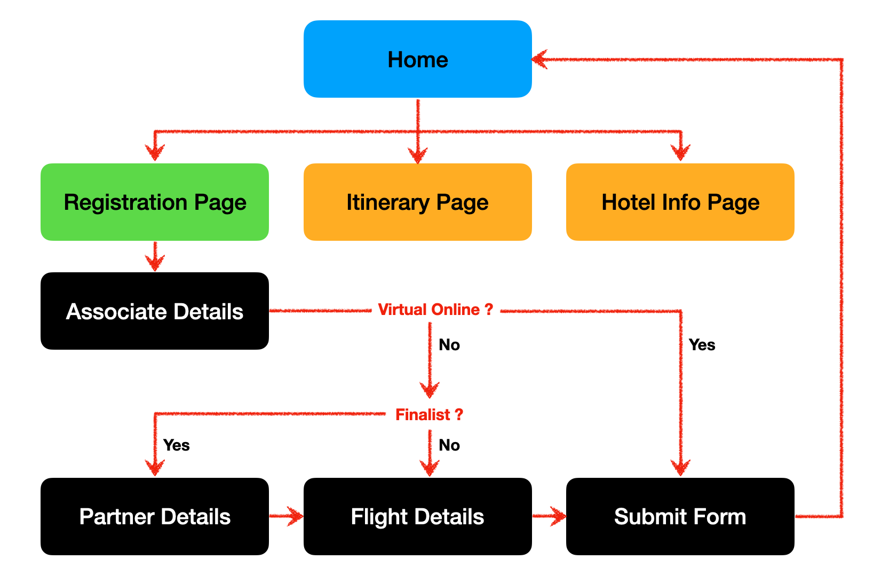

# Mini Project :  Form submission to Google Sheet 

## Deployed site : [ https://asia-mtd.netlify.app/ ]

## Technologies:
- React
- Submission to google sheet via React
- Bootstrap
- HTML/CSS/JS

## Customer Requirement: 

- If attendence type is Finalist, will allow to add partner detail.
- If Participating in Virtual Online, they can submit directly without a need to submit flight details.

## Navigation

